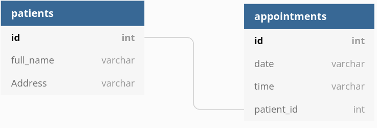

# Clinic

## Description
- It is a clinic application in which the patient enters his information , date and time to book an
  appointment with the doctor. . 

## links
[heroku link](https://clinic-g11.herokuapp.com/)

## schema

## User Stories 

- As a user I can add my name , my phone and by address.
- As a user I can click at add button to book an appointment.
- As a user I can search about my name at list of names to enter the time and date.
- As a user I can add date and time.
- As a user I can click at submit button to book an appointment.
- As a user I can click at link to move to the appoinment page and see the appointments

## User journey  

- when you open the app, if you are new paintent you will enter your name ,phone,address,time
  and date to book an appoinment. but if you are old paintent you will see your name at the list , you will choose your name and enter the date and time you want to book a new appoinment.    

## Tech Stack :clipboard: 
- HTML
- CSS
- JS
- DOM
- Express js 
- database

## Team Members  
- [Fady Alwazir](https://github.com/Fady-Alwazir)
- [Wessal Elkhatib](https://github.com/WessalJawad95)

